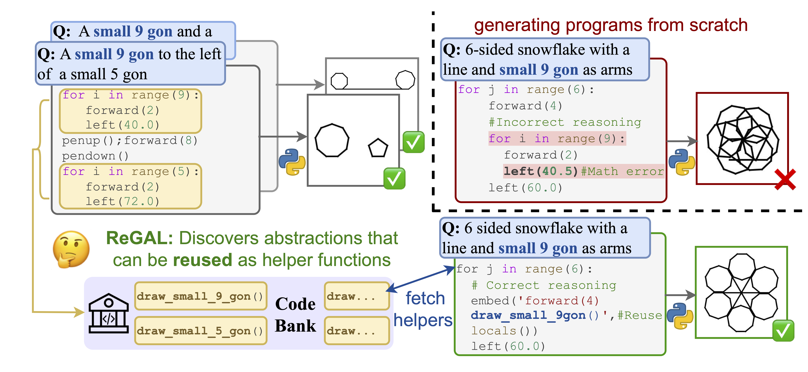
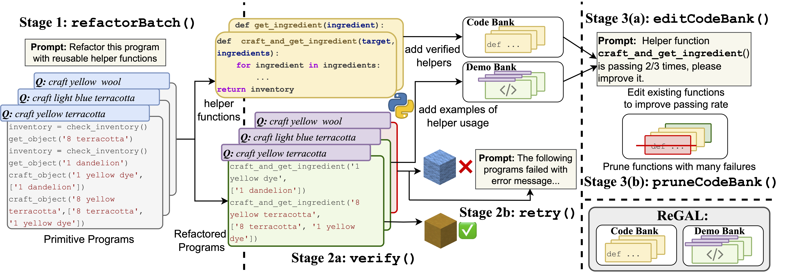

# REGAL: Refactoring Programs to Discover Generalizable Abstractions 
[](https://huggingface.co/papers/2401.16467)


- Authors: [Elias Stengel-Eskin](https://esteng.github.io), [Archiki Prasad](https://archiki.github.io), [Mohit Bansal](https://www.cs.unc.edu/~mbansal/)
- [Paper](https://arxiv.org/abs/2401.16467) 



## Overview
This repo contains code for our paper: [REGAL: Refactoring Programs to Discover Generalizable Abstractions](https://arxiv.org/abs/2401.16467) 
REGAL is a method for learning libraries of interpretable helper functions for program synthesis in a diverse range of tasks. 
Please see the figure below (and our paper) for more details. 



## Dependencies 
Dependencies can be installed by running 

```
pip install -r requirements.txt 
```


## Scripts 
Scripts for preprocessing ReGAL can be found in `scripts/<domain>/preprocess.sh`.
These require an `OPENAI_API_KEY` environment variable to be set. 

Scripts for training ReGAL on LOGO and Date can be found in 
`scripts/<domain>/train_regal.sh` 
After training, the resulting logs and saved CodeBank files will be in `logs`.

TextCraft: coming soon!

Scripts for evaluation on CodeLlama-13B are in `scripts/<domain>/test_regal.sh`

# Reference
Please cite our paper as 
```
@article{stengeleskin2024regal,
    title = {ReGAL: Refactoring Programs to Discover Generalizable Abstractions},
    author = {Stengel-Eskin, Elias and Prasad, Archiki and Bansal, Mohit}, 
    year = {2024},
    journal={arXiv preprint 2401.16467} 
}
```
